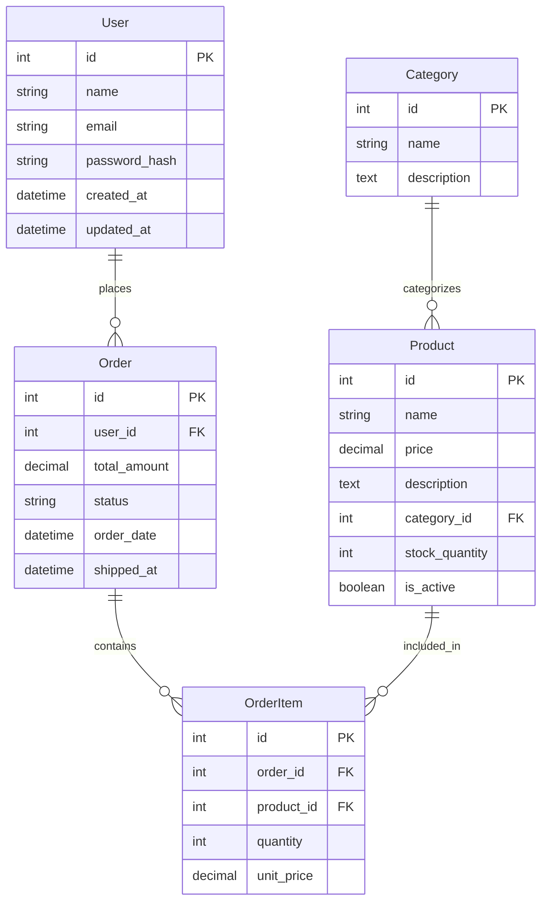

# MDAI MCP Server

統合設計書システム用のModel Context Protocol (MCP) サーバー。AI動的生成によりWebUIとClaude Desktop両方からインテリジェントなデータモデル生成機能を提供します。

## 📍 位置づけ

### 統合設計書システムにおける役割
- **AI生成の分離**: WebUIから独立したAI処理サーバー
- **MCP標準準拠**: Claude Desktop等の標準MCPクライアントに対応
- **双方向対応**: WebUI統合とスタンドアロン利用の両立

### 利用可能な環境
1. **WebUI統合**: ModelChatPanelからのシームレス呼び出し
2. **Claude Desktop**: @メンション形式での直接利用
3. **その他MCPクライアント**: VS Code、CLI等での標準MCP利用

## 🚀 主要機能

- **🤖 AI動的生成**: OpenAI GPT-4.1 / AWS Bedrock Claudeによる高品質Mermaid ER図生成
- **📊 インテリジェント設計**: ユーザープロンプトに応じた業界特化データモデル自動設計
- **🔄 自動最適化**: Mermaid構文エラーの自動検出・修正、PK/FK関係の適切な処理
- **⚡ 2種類のTransport**: stdio（Claude Desktop用）+ HTTP（WebUI用）
- **🛡️ 堅牢性**: AI失敗時のフォールバック機能とエラーハンドリング

## 📋 クイックスタート

### 1. 環境準備
```bash
# mcp-serverディレクトリに移動
cd mcp-server

# 環境変数設定
cp .env.example .env
# .envファイルを編集してOpenAI API キーを設定

# 依存関係インストール
uv sync
```

### 2. WebUI統合での使用
```bash
# MCPサーバー起動（自動リロード）
uv run mdai-http-server

# 別ターミナルでWebUI起動
cd ..
npm run dev

# WebUIのModelChatPanelで「ECサイトのデータモデルを作って」
```

### 3. Claude Desktop単体での使用
```bash
# 標準MCPサーバー起動
uv run mdai-mcp-server

# Claude Desktop設定（後述）後、Claude Desktopで：
# @mdai-model-server ECサイトのデータモデルを作成してください
```

## 🖥️ Claude Desktop 設定

### 設定ファイルの場所
```bash
# macOS
~/Library/Application Support/Claude/claude_desktop_config.json

# Windows  
%APPDATA%\Claude\claude_desktop_config.json

# Linux
~/.config/Claude/claude_desktop_config.json
```

### 設定内容
```json
{
  "mcpServers": {
    "mdai-model-server": {
      "command": "/opt/homebrew/bin/uv",
      "args": [
        "--directory",
        "/Users/akiraabe/practice/design-doc-editor/mcp-server",
        "run",
        "mdai-mcp-server"
      ],
      "cwd": "/Users/akiraabe/practice/design-doc-editor/mcp-server",
      "env": {
        "OPENAI_API_KEY": "your-openai-api-key"
      }
    }
  }
}
```

### 設定手順
1. **uvコマンドの場所確認**: `which uv`
2. **API Key設定**: 上記JSONのOPENAI_API_KEYを自分のキーに変更
3. **設定ファイル編集**: 上記JSONを追加（パスは環境に応じて調整）
4. **Claude Desktop再起動**: 設定反映のため完全再起動
5. **接続テスト**: `@mdai-model-server ping`

### 🔒 セキュリティ注意事項
- **API Key管理**: 設定ファイルにAPI Keyが平文で記録されます
- **アクセス制御**: ファイル権限を適切に設定してください
- **共有注意**: 設定ファイルを他者と共有しないでください

```bash
# 設定ファイルの権限を制限（推奨）
chmod 600 ~/Library/Application\ Support/Claude/claude_desktop_config.json
```

## 💬 Claude Desktop での使用方法

### 基本的な使い方
```
@mdai-model-server ECサイトのデータモデルを作成してください
```

### 具体的なプロンプト例

**🛒 ECサイト系**
```
ECサイトの注文管理システムのデータモデルを作って
- ユーザー登録・認証
- 商品カタログ管理  
- 注文・決済処理
- レビュー・評価機能
```

**📚 業務システム**
```
プロジェクト管理システムのER図を設計してください
- チーム・メンバー管理
- タスク・マイルストーン
- 工数・進捗管理
- ファイル・ドキュメント管理
```

**🏥 特定業界**
```
診療管理システムのデータモデルを設計
- 患者・医師情報
- 診療科・予約管理
- 診察・処方記録
- 検査・画像データ
```

### 期待される出力
Claude DesktopがMCPサーバーを呼び出し、AIが生成したプロンプト特化のMermaid ER図を表示・解説します：



**AI生成の特徴:**
- **業界標準**: ECサイトの標準的なデータ構造
- **関係性**: 適切なリレーションとカーディナリティ
- **実用性**: 実際のシステム開発で使用可能なレベル

## 🔧 開発・保守

### 主要コマンド
```bash
# WebUI統合用（自動リロード）
uv run mdai-http-server

# Claude Desktop用（stdio通信）
uv run mdai-mcp-server

# ヘルスチェック
curl http://localhost:3001/health

# API直接テスト
curl -X POST http://localhost:3001/ \
  -H "Content-Type: application/json" \
  -d '{"method": "ping", "id": "test"}'
```

### ファイル構成
```
mcp-server/
├── src/mdai_mcp_server/
│   ├── server.py          # 標準MCPサーバー（stdio）
│   ├── http_server.py     # HTTP APIサーバー（WebUI用）
│   ├── ai_service.py      # AI生成サービス
│   └── tools/             # MCPツール実装
├── .env                   # 環境変数（作成必要）
├── README.md              # このファイル（概要・使い方）
└── TECHNICAL.md           # 技術詳細・開発情報
```

## 🛠️ トラブルシューティング

### よくある問題

**Claude Desktop接続エラー**
```
error: Failed to spawn: `mdai-mcp-server`
```
→ 設定ファイルのuvパス・プロジェクトパスを確認

**AI生成エラー**
```
erDiagram
    ERROR { ... }
```
→ .envファイルのOPENAI_API_KEY設定を確認

**WebUI連携エラー**
→ MCPサーバー（port 3001）とWebUI（port 5173）の両方が起動しているか確認

### サポート
問題発生時は以下の情報とともにお問い合わせください：
- サーバーログ（ターミナル出力）
- 環境情報（`uv --version`, `which uv`）
- 設定ファイル内容（APIキーは除く）

## 📖 関連リンク

- **[技術詳細・開発情報](./TECHNICAL.md)**: API仕様・デバッグ・アーキテクチャ
- **[統合設計書システム](../CLAUDE.md)**: プロジェクト全体の概要
- **[Model Context Protocol](https://modelcontextprotocol.io/)**: MCP標準仕様
- **[GitHub Issue #8](https://github.com/akiraabe/mdai-designer/issues/8)**: MCP準拠性検証・改善計画
